# 🏠 SmartHome - Sistema de Gestión Domótica

---

## Tabla de Contenidos

- [Características Principales](#características-principales)
- [Funcionalidades](#funcionalidades)
- [Arquitectura](#arquitectura)
- [Tecnologías](#tecnologías)
- [Estructura del Proyecto](#estructura-del-proyecto)
- [Instalación y Configuración](#instalación-y-configuración)
- [Uso del Sistema](#uso-del-sistema)
- [Testing](#testing)
- [Sistema de Logging](#sistema-de-logging)
- [Validaciones y Seguridad](#validaciones-y-seguridad)
- [Manejo de Excepciones](#manejo-de-excepciones)
- [Autores](#autores)

---

# Características Principales

### 🎨 **Interfaz de Usuario**

El sistema cuenta con una interfaz de consola profesional implementada con la librería **Rich**:

- ✅ **Tablas formateadas** con colores y bordes
- ✅ **Paneles estilizados** para mensajes y menús
- ✅ **Banner de bienvenida** adaptable al tamaño de terminal
- ✅ **Mensajes de estado** con íconos (✓, ✗, ⚠️, 🏠, 📱, ⚡)
- ✅ **Progress bars** para operaciones largas
- ✅ **Colores semánticos** (verde=éxito, rojo=error, amarillo=advertencia)

### 🔐 **Seguridad y Configuración**

- ✅ **Variables de entorno (.env)** para credenciales sensibles
- ✅ **Validaciones robustas** de todos los inputs del usuario
- ✅ **Expresiones regulares** para validación de emails
- ✅ **Requisitos de contraseña** configurables
- ✅ **Autenticación por roles** (Admin/Usuario Estándar)
- ✅ **Excepciones personalizadas** para cada tipo de error

### 📊 **Sistema de Logging Completo**

Sistema profesional de registro de eventos con:

- ✅ **Logs rotativos** (5MB por archivo, 5 backups automáticos)
- ✅ **Múltiples handlers** (archivos + consola)
- ✅ **Loggers especializados** por componente (auth, database, devices, automations)
- ✅ **Separación de logs**: `app.log` (general) y `errors.log` (solo errores)
- ✅ **Formato estructurado** con timestamps, niveles y contexto
- ✅ **Registro automático** de todas las operaciones críticas

### 🧪 **Testing Robusto**

- ✅ **285 tests** automatizados (unitarios + integración)
- ✅ **71% de cobertura** total de código
- ✅ **95% de cobertura** en capa de dominio
- ✅ **60% de cobertura** en capa DAO
- ✅ **84% de cobertura** en capa de servicios
- ✅ **Tests organizados** por capas (domain, dao, services, integration)
- ✅ **Configuración pytest** profesional con fixtures reutilizables
- ✅ **Reportes HTML** de cobertura automáticos
- ✅ **100% de tests pasando** sin fallos

---

[Tabla de contenidos](#tabla-de-contenidos)

# Funcionalidades

### 👤 **Para Usuarios Estándar**

#### Autenticación

- **Registro** de nuevos usuarios con validaciones
- **Inicio de sesión** seguro
- **Consulta** de datos personales

#### Dispositivos

- **Visualización** de dispositivos por hogar
- **Información completa** de cada dispositivo (tipo, estado, ubicación)
- **Organización** por hogares y ubicaciones

#### Automatizaciones

- **Visualización** de automatizaciones por hogar
- **Información completa** de cada automatiazción

### 👨‍💼 **Para Administradores**

#### Gestión de Dispositivos (CRUD Completo)

- **Crear** nuevos dispositivos
- **Listar** todos los dispositivos del sistema
- **Actualizar** información y estados
- **Eliminar** dispositivos
- **Cambiar estados** de dispositivos

### Gestión de Automatizaciones (CRUD Completo)

- **Crear** automatizaciones personalizadas
- **Visualizar** automatizaciones por hogar
- **Activar/Desactivar** automatizaciones
- **Actualizar** automatizaciones existentes
- **Eliminar** automatizaciones

#### Gestión de Usuarios

- **Cambiar roles** de usuarios (admin ↔ estándar)
- **Visualizar** información de usuarios

---

[Tabla de contenidos](#tabla-de-contenidos)

# Arquitectura

### **Arquitectura en Capas (Layered Architecture)**

```
┌─────────────────────────────────────┐
│      main.py (Orquestación)         │  ← Punto de entrada
└───────────────┬─────────────────────┘
                │
                ▼
┌─────────────────────────────────────┐
│    UI LAYER (rich_console_ui.py)    │  ← Presentación (Rich UI)
│         └── rich_utils.py           │
│         └── rich_utils.py           │
└───────────────┬─────────────────────┘
                │
                ▼
┌─────────────────────────────────────┐
│  SERVICE LAYER                      │  ← Lógica de Negocio
│  ├── auth_service.py                │     • Validaciones
│  ├── device_service.py              │     • Reglas de negocio
│  └── automation_service.py          │     • Orquestación
└───────────────┬─────────────────────┘
                │
                ▼
┌─────────────────────────────────────┐
│  DAO LAYER (Acceso a Datos)         │  ← Persistencia
│  ├── user_dao.py                    │     • CRUD operations
│  ├── device_dao.py                  │     • Queries
│  ├── automation_dao.py              │     • Transacciones
│  └── ... (más DAOs)                 │
└───────────────┬─────────────────────┘
                │
                ▼
┌─────────────────────────────────────┐
│  DOMAIN LAYER (Entidades)           │  ← Modelos de Dominio
│  ├── user.py                        │     • Entidades
│  ├── device.py                      │     • Lógica de dominio
│  ├── automation.py                  │     • Encapsulación
│  └── ... (más entidades)            │
└───────────────┬─────────────────────┘
                │
                ▼
┌─────────────────────────────────────┐
│  UTILS LAYER                        │  ← Utilidades
│  ├── logger.py (Logging)            │     • Logging
│  ├── validators.py (Validaciones)   │     • Validaciones
│  └── exceptions.py (Excepciones)    │     • Excepciones
└───────────────┬─────────────────────┘
                │
                ▼
┌─────────────────────────────────────┐
│  DATABASE LAYER                     │  ← Gestión de BD
│  ├── setup_database.py              │     • Setup automatizado
│  ├── config.py                      │     • Configuración
│  ├── schema/                        │     • DDL
│  └── seeds/                         │     • Datos iniciales
└───────────────┬─────────────────────┘
                │
                ▼
┌─────────────────────────────────────┐
│  CONNECTION LAYER                   │  ← Conexión a BD
│  └── db_connection.py (Singleton)   │     • Singleton pattern
└───────────────┬─────────────────────┘
                │
                ▼
┌─────────────────────────────────────┐
│     MySQL Database (BD)             │  ← Almacenamiento
└─────────────────────────────────────┘
```

### 🎨 **Patrones de Diseño y arquitectura Implementados**

1. **Layered Architecture** - Separación clara de responsabilidades
2. **Service Layer Pattern** - Lógica de negocio encapsulada
3. **DAO Pattern** - Acceso a datos desacoplado del dominio
4. **Singleton Pattern** - Única instancia de conexión a BD
5. **Dependency Injection** - Inversión de control manual
6. **Repository Pattern** - Abstracción de colecciones de datos

---

[Tabla de contenidos](#tabla-de-contenidos)

# Tecnologías

### **Lenguajes y Frameworks**

- **Python 3.11+** - Lenguaje principal con type hints
- **MySQL 8.0** - Base de datos relacional

### **Librerías Python**

#### Producción

```
mysql-connector-python==8.0.33   # Conexión a MySQL
rich==13.7.0                     # UI avanzada en consola
python-dotenv==1.0.0             # Gestión de variables de entorno
```

#### Desarrollo y Testing

```
pytest==7.4.3                    # Framework de testing
pytest-cov==4.1.0                # Cobertura de código
```

---

[Tabla de contenidos](#tabla-de-contenidos)

# Estructura del Proyecto

```
SmartHome/
│
├── 📁 database/                    # Gestión de Base de Datos
│   ├── 📁 schema/                  # DDL - Estructura
│   │   ├── create_tables.sql       # Definición de tablas
│   │   └── __init__.py
│   ├── 📁 seeds/                   # DML - Datos iniciales
│   │   ├── 01_roles.sql            # Roles del sistema
│   │   ├── 02_states.sql           # Estados de dispositivos
│   │   ├── 03_locations.sql        # Ubicaciones
│   │   ├── ...(más seeds)
│   │   └── __init__.py
│   ├── config.py                   # Configuración de BD
│   ├── setup_database.py           # Script de setup
│   └── __init__.py
│
├── 📁 scripts/                     # Scripts de automatización
│   ├── init_db.sh                  # Inicialización (Linux/Mac)
│   └── init_db.bat                 # Inicialización (Windows)
│
├── 📁 ui/                          # Capa de Presentación
│   ├── rich_console_ui.py          # UI con Rich (principal)
│   ├── rich_utils.py               # Utilidades de Rich
│   └── __init__.py
│
├── 📁 services/                    # Lógica de Negocio
│   ├── auth_service.py
│   ├── device_service.py
│   ├── automation_service.py
│   └── __init__.py
│
├── 📁 dao/                         # Acceso a Datos
│   ├── user_dao.py
│   ├── device_dao.py
│   ├── automation_dao.py
│   └── ... (más DAOs)
│
├── 📁 dominio/                     # Entidades de Dominio
│   ├── user.py
│   ├── device.py
│   ├── automation.py
│   └── ... (más entidades)
│
├── 📁 interfaces/                  # Interfaces DAO
│   ├── i_dao.py
│   ├── i_user_dao.py
│   └── i_device_dao.py
│
├── 📁 conn/                        # Conexión a BD
│   ├── db_connection.py
│   └── __init__.py
│
├── 📁 utils/                       # Utilidades del Sistema
│   ├── logger.py
│   ├── validators.py
│   ├── exceptions.py
│   └── __init__.py
│
├── 📁 tests/                       # Tests (241 tests)
│   ├── 📁 test_domain/
│   ├── 📁 test_services/
│   ├── 📁 test_dao/
│   ├── 📁 test_integration/
│   ├── conftest.py
│   └── __init__.py
│
├── 📁 logs/                        # Archivos de Log
│   ├── app.log
│   └── errors.log
│
├── .env                            # Variables de entorno (gitignored)
├── .env.example                    # Template de configuración
├── .gitignore
├── pytest.ini
├── requirements.txt
├── main.py
└── README.md
```

---

[Tabla de contenidos](#tabla-de-contenidos)

# Instalación y Configuración

### 📋 **Prerrequisitos**

- Python 3.11 o superior
- MySQL 8.0 o superior
- pip (gestor de paquetes de Python)
- Git

### **Paso 1: Clonar el Repositorio**

```bash
git clone https://github.com/tu-usuario/SmartHome.git
cd SmartHome
```

### **Paso 2: Crear Entorno Virtual**

```bash
# Windows
python -m venv venv
venv\Scripts\activate

# Linux/Mac
python3 -m venv venv
source venv/bin/activate
```

### **Paso 3: Instalar Dependencias**

```bash
pip install -r requirements.txt
```

**Se instalarán:**

- ✅ `mysql-connector-python` (8.0.33)
- ✅ `rich` (13.7.0)
- ✅ `python-dotenv` (1.0.0)
- ✅ `pytest` (7.4.3)
- ✅ `pytest-cov` (4.1.0)

### **Paso 4: Configurar Variables de Entorno**

**a) Copiar el template:**

```bash
# Windows
copy .env.example .env

# Linux/Mac
cp .env.example .env
```

**b) Editar `.env` con tus credenciales:**

```env
# Database Configuration
DB_HOST=localhost
DB_PORT=3306
DB_DATABASE=smarthome
DB_USER=root
DB_PASSWORD=tu_password_aqui    # ⚠️ CAMBIAR ESTO
```

⚠️ **IMPORTANTE:** El archivo `.env` contiene información sensible. **NUNCA** lo subas a Git.

### **Paso 5: Configuración de Base de Datos**

El sistema incluye un módulo completo de gestión de base de datos con scripts automáticos.

### **📁 Estructura de la Base de Datos**

```
database/
├── schema/
│   └── create_tables.sql       # DDL - Define estructura
├── seeds/
│   ├── 01_roles.sql            # Roles (admin, standard)
│   ├── 02_states.sql           # Estados de dispositivos
│   ├── 03_locations.sql        # Ubicaciones
│   ├── 04_device_types.sql     # Tipos de dispositivos
│   ├── 05_homes.sql            # Hogares de ejemplo
│   ├── 06_users.sql            # Usuarios de prueba
│   ├── 07_user_homes.sql       # Relaciones
│   ├── 08_devices.sql          # Dispositivos de ejemplo
│   ├── 09_automations.sql      # Automatizaciones
│   ├── 10_device_automations.sql
│   └── 11_events.sql           # Eventos del sistema
├── config.py                   # Configuración centralizada
└── setup_database.py           # Script de setup automático
```

### **🎯 Opción A: Setup Automático (Recomendado)**

Esta es la forma más rápida y sencilla de configurar todo el sistema.

#### **Windows:**

```cmd
# Ejecutar el script de inicialización
scripts\init_db.bat
```

#### **Linux/Mac:**

```bash
# Dar permisos de ejecución
chmod +x scripts/init_db.sh

# Ejecutar el script
./scripts/init_db.sh
```

#### **Alternativa (cualquier sistema):**

```bash
# Ejecutar directamente el script Python
python database/setup_database.py --all
```

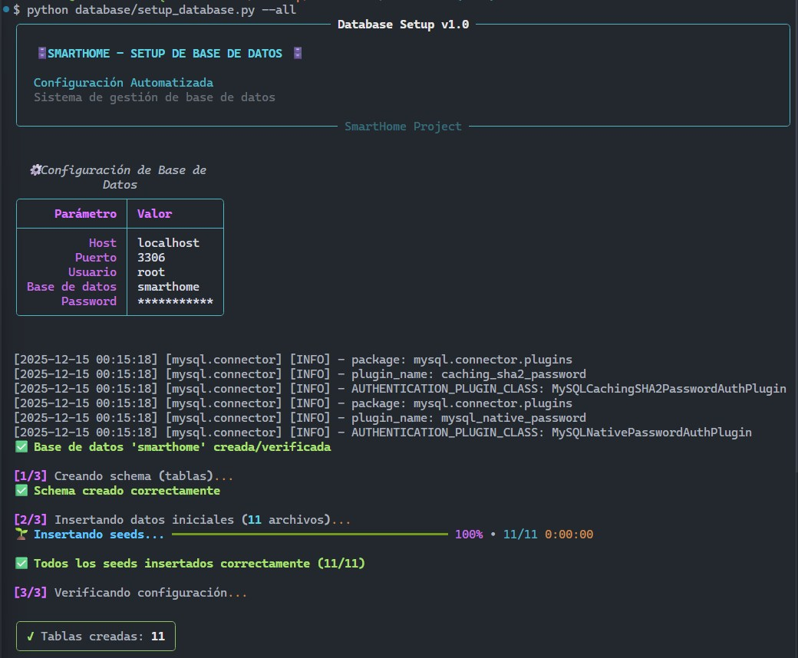
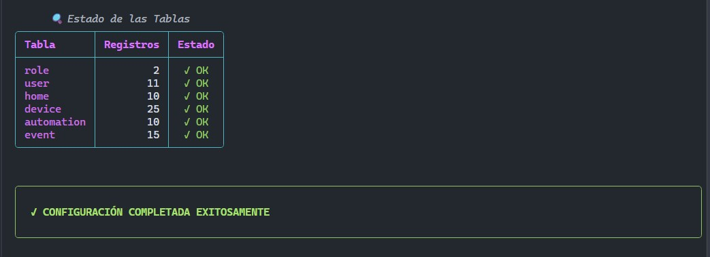

**Este comando hace:**

1. ✅ Crea la base de datos `smarthome`
2. ✅ Crea todas las tablas (schema)
3. ✅ Inserta datos iniciales (seeds)
4. ✅ Verifica la configuración

---

### **🎯 Opción B: Setup Manual (Control Total)**

Si prefieres ejecutar cada paso manualmente:

#### **1. Crear la base de datos:**

```bash
python database/setup_database.py --create-db
```

Salida esperada:

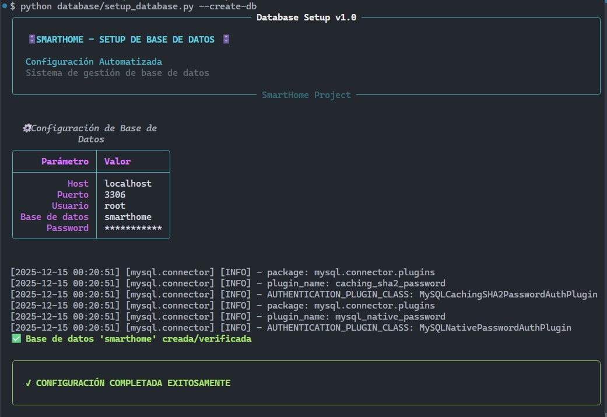

#### **2. Crear las tablas (schema):**

```bash
python database/setup_database.py --schema
```

Salida esperada:

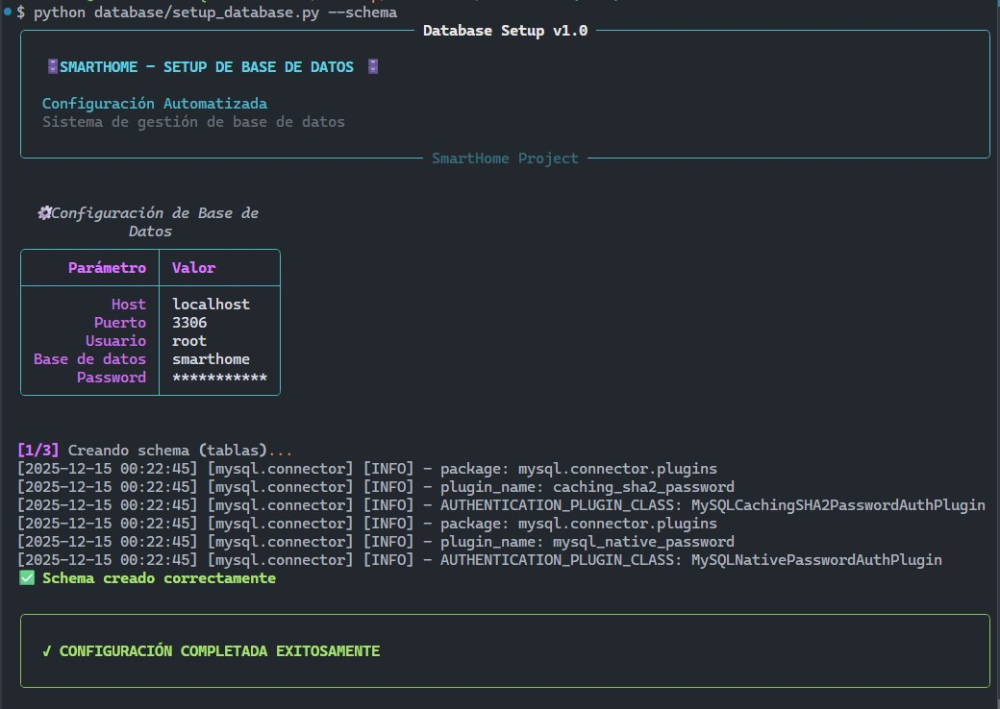

#### **3. Insertar datos iniciales (seeds):**

```bash
python database/setup_database.py --seed
```

Salida esperada:

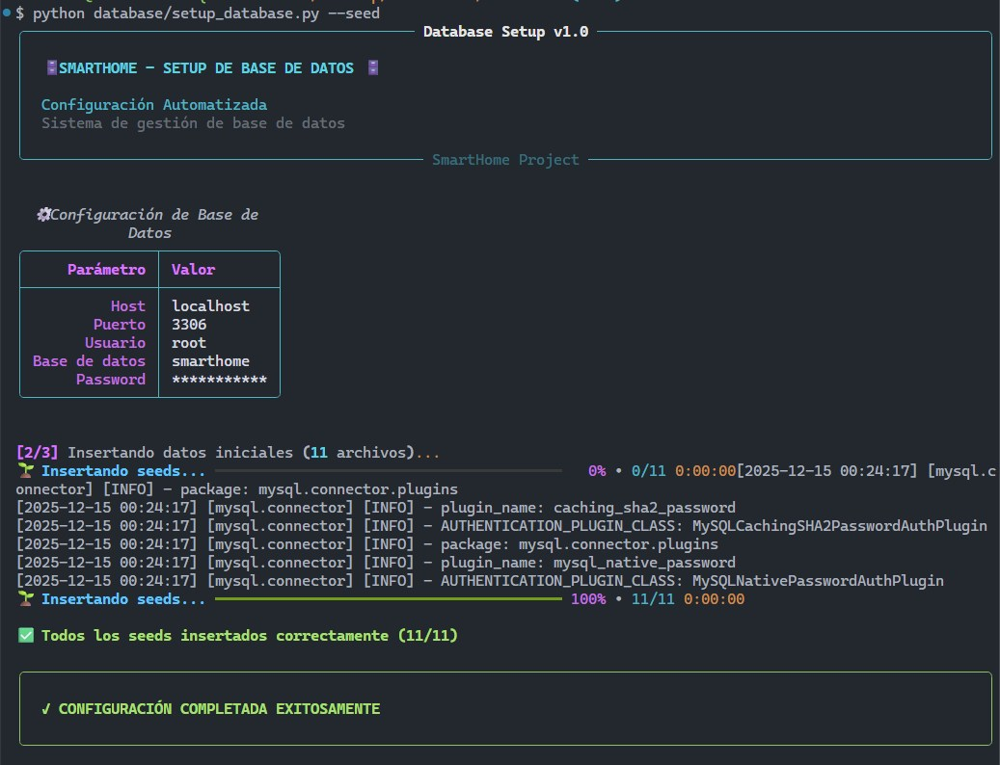

#### **4. Verificar configuración:**

```bash
python database/setup_database.py --verify
```

Salida esperada:

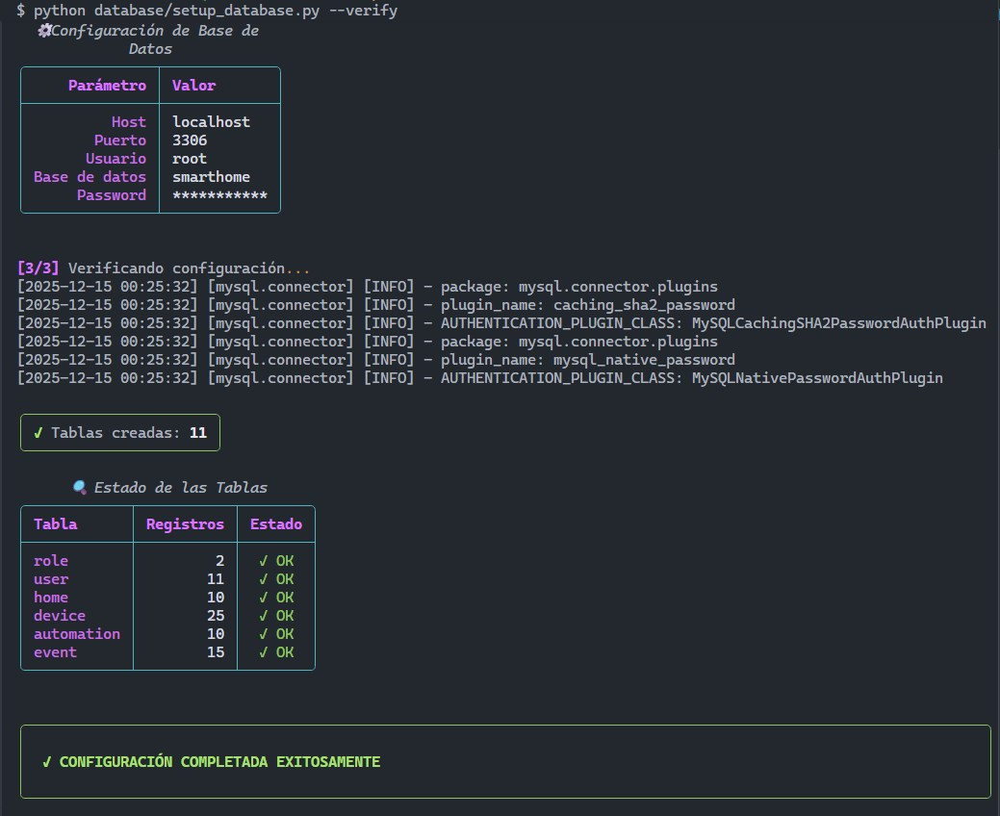

---

### **🔄 Resetear la Base de Datos (Desarrollo)**

Si necesitas empezar de cero durante el desarrollo:

```bash
python database/setup_database.py --reset --all
```

⚠️ **ADVERTENCIA:** Esto eliminará TODOS los datos existentes. El sistema te pedirá confirmación.

```
⚠️  ¿Está seguro de ELIMINAR la base de datos? (escriba 'SI'): SI
```

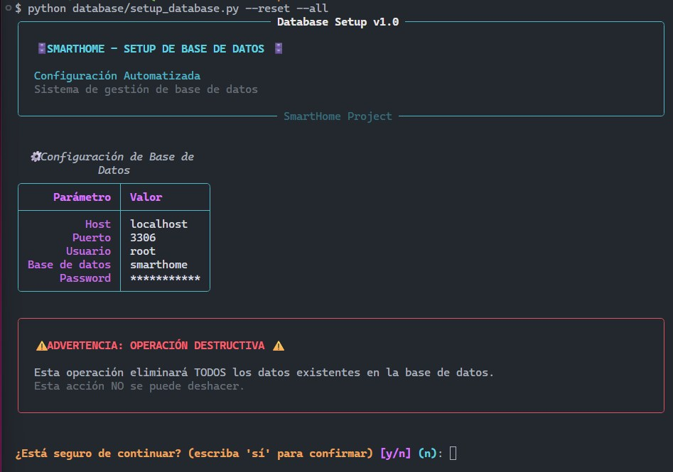

**Reset Ok**

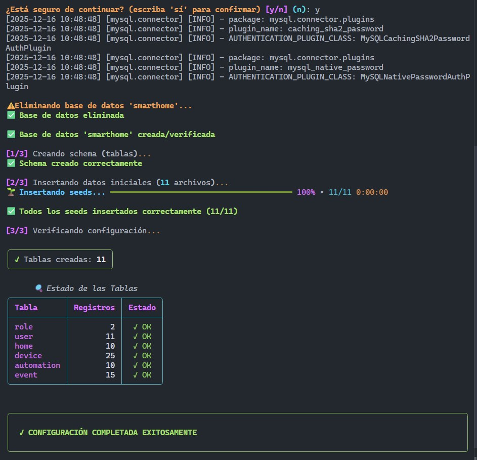

---

### **📊 Comandos Disponibles**

```bash
# Ver todas las opciones disponibles
python database/setup_database.py --help

# Comandos individuales
python database/setup_database.py --create-db   # Solo crear BD
python database/setup_database.py --schema      # Solo crear tablas
python database/setup_database.py --seed        # Solo insertar datos
python database/setup_database.py --verify      # Solo verificar

# Comandos combinados
python database/setup_database.py --all         # Todo: crear + schema + seed + verify
python database/setup_database.py --reset --all # Resetear y recrear todo
```

---

### **🔧 Configuración Avanzada**

#### **Cambiar credenciales de BD:**

Edita el archivo `database/config.py`:

```python
DB_CONFIG: Dict[str, str] = {
    'host': os.getenv('DB_HOST', 'localhost'),
    'user': os.getenv('DB_USER', 'root'),
    'password': os.getenv('DB_PASSWORD'),
    'port': int(os.getenv('DB_PORT', '3306'))
}
```

O mejor aún, usa variables de entorno en `.env`:

```env
DB_HOST=localhost
DB_PORT=3306
DB_USER=root
DB_PASSWORD=mi_password_seguro
```

---

### **✅ Verificación de Instalación Completa**

Después de configurar todo, ejecuta:

```bash
python main.py
```

Si ves el menú principal con la interfaz Rich, ¡todo está funcionando! 🎉

---

### **📝 Datos de Prueba Incluidos**

El sistema incluye datos de ejemplo listos para usar:

#### **Credenciales de Administrador:**

```
Email: admin@smarthome.com
Password: admin123
```

#### **Credenciales de Usuario Estándar:**

```
Email: juan.perez@email.com
Password: pass123
```

#### **Datos incluidos:**

- ✅ 2 roles (admin, standard)
- ✅ 11 usuarios de prueba
- ✅ 10 hogares de ejemplo
- ✅ 25 dispositivos configurados
- ✅ 10 automatizaciones
- ✅ 10 estados de dispositivos
- ✅ 12 ubicaciones
- ✅ 12 tipos de dispositivos
- ✅ 15 eventos del sistema

---

### **🐛 Solución de Problemas**

#### **Error: "Access denied for user 'root'@'localhost'"**

**Solución:** Verifica que la contraseña en `database/config.py` sea correcta.

```python
'password': os.getenv('DB_PASSWORD')
```

#### **Error: "Can't connect to MySQL server"**

**Solución:** Verifica que MySQL esté ejecutándose:

```bash
# Windows
net start MySQL80

# Linux/Mac
sudo service mysql start
```

#### **Error: "Database 'smarthome' doesn't exist"**

**Solución:** Ejecuta el comando de creación:

```bash
python database/setup_database.py --create-db
```

#### **Error: "Table 'user' doesn't exist"**

**Solución:** Ejecuta el comando de schema:

```bash
python database/setup_database.py --schema
```

---

### **📚 Más Información**

Para más detalles sobre la estructura de la base de datos, consulta:

- 📄 `database/schema/create_tables.sql` - Definición de tablas
- 📄 `database/seeds/` - Datos de ejemplo
- 📄 `database/setup_database.py` - Código del script de setup

---

[Tabla de contenidos](#tabla-de-contenidos)

# Uso del Sistema

### 1. ▶️ **Ejecutar la Aplicación**

```bash
python main.py
```

### 2. 📱 **Pantalla de Bienvenida**

Al ejecutar, verás una interfaz moderna con Rich:

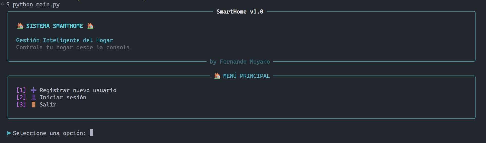

### 2.1 **📺 Registrar Usuario (Standard por defecto)**

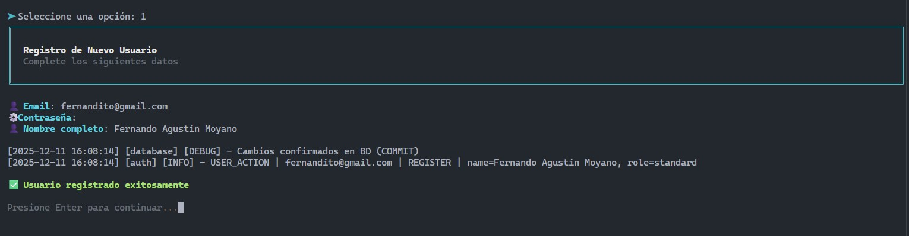

### 2.2 **🔑 Inicio de sesión**

#### Administrador

```
Email: admin@smarthome.com
Password: admin123
```

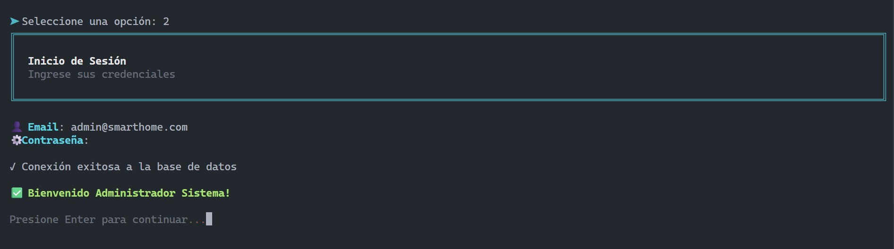

#### Usuario Estándar

```
Email: juan.perez@email.com
Password: pass123
```

**Validaciones aplicadas:**

- ✅ Email con formato correcto
- ✅ Contraseña con longitud mínima
- ✅ Nombre sin caracteres especiales
- ✅ Email único (no duplicados)

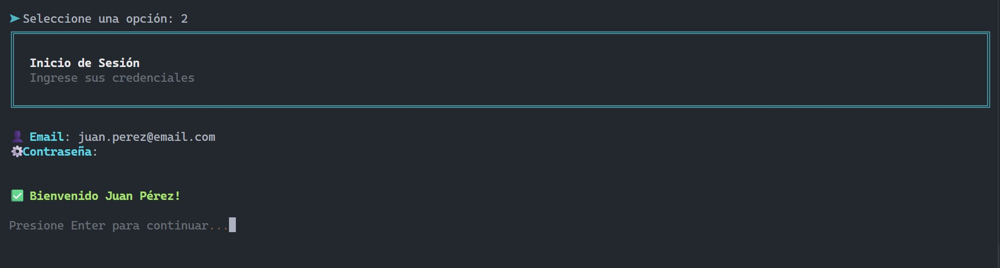

### 2.3. **🚪 Salir**

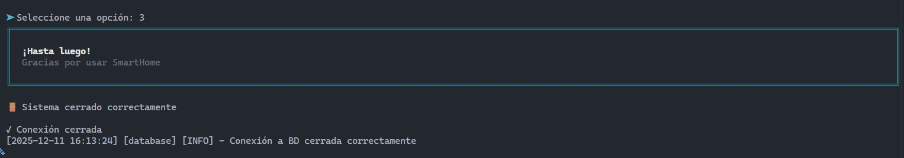

### 📖 **Guía de Uso**

#### Como Usuario Estándar

**1. Ver datos personales**

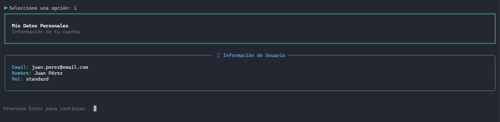

**2. Ver Dispositivos**

```
→ Visualiza dispositivos organizados por hogar
→ Información completa de cada dispositivo
```

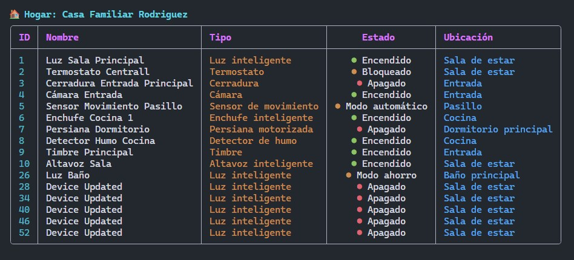
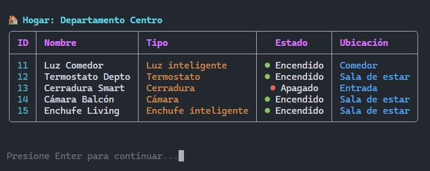

**3. Visualizar Automatizaciones**

```
→ Ver automatizaciones por hogar con Descripción y Estado
```

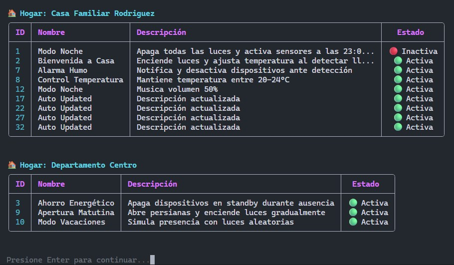

#### Como Administrador

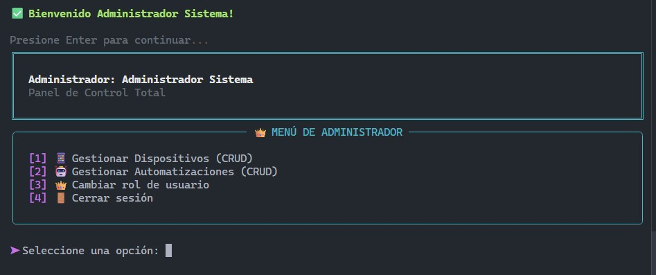

**1. Gestión de Dispositivos (CRUD)**

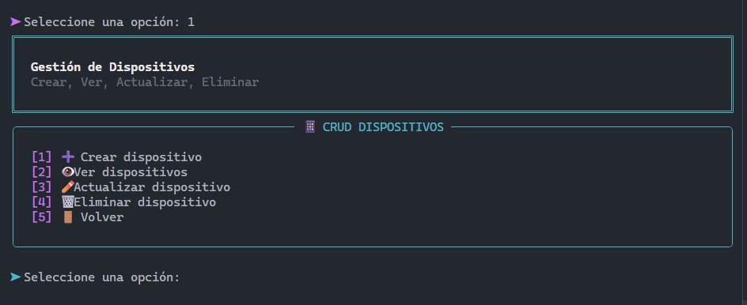

**2. Gestionar Automatizaciones (CRUD)**

```
→ CRUD de automatizaciones
  - Crear automatizaciones, ver, actualizar, activar, desactivar, eliminar
```

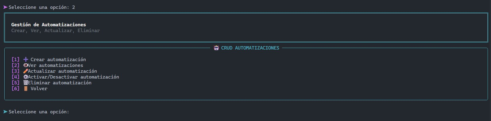

**3. Cambiar rol de usuario**

```
→ Ingresar email del usuario
→ Seleccionar nuevo rol (Admin/Estándar)
```

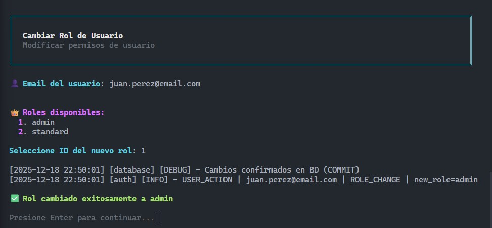

**4. Cerrar sesión**

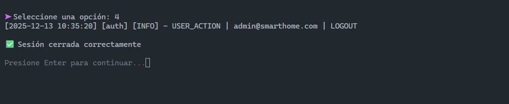

---

[Tabla de contenidos](#tabla-de-contenidos)

# Testing

## 🧪 **Estructura de Tests**

```
tests/
├── 📁 test_domain/          # 78 tests - Tests de entidades del dominio
│   ├── test_user.py         # 18 tests - Validaciones, autenticación
│   ├── test_device.py       # 15 tests - Dispositivos inteligentes
│   ├── test_automation.py   # 17 tests - Automatizaciones
│   ├── test_role.py         #  7 tests - Roles del sistema
│   ├── test_state.py        #  8 tests - Estados de dispositivos
│   ├── test_home.py         # 10 tests - Hogares
│   ├── test_event.py        # 16 tests - Eventos del sistema
│   ├── test_location.py     #  9 tests - Ubicaciones
│   └── test_device_type.py  #  9 tests - Tipos de dispositivos
│
├── 📁 test_dao/             # 67 tests - Tests de acceso a datos
│   ├── test_user_dao.py     # 15 tests - CRUD de usuarios
│   ├── test_device_dao.py   # 12 tests - CRUD de dispositivos
│   ├── test_automation_dao.py # 12 tests - CRUD de automatizaciones
│   ├── test_home_dao.py     #  9 tests - CRUD de hogares
│   ├── test_role_dao.py     #  9 tests - CRUD de roles
│   ├── test_state_dao.py    #  9 tests - CRUD de estados
│   └── test_user_dao.py     # 15 tests - Validaciones y autenticación
│
├── 📁 test_services/        # 112 tests - Tests de lógica de negocio
│   ├── test_auth_service.py        # 26 tests - Autenticación
│   ├── test_device_service.py      # 41 tests - Gestión de dispositivos
│   └── test_automation_service.py  # 45 tests - Gestión de automatizaciones
│
├── 📁 test_integration/     # 28 tests - Tests de integración
│   ├── test_basic_integration.py   #  4 tests - Tests básicos
│   ├── test_device_flow.py         #  8 tests - Flujos de dispositivos
│   ├── test_automation_flow.py     #  6 tests - Flujos de automatizaciones
│   └── test_home_management_flow.py # 10 tests - Gestión de hogares
│
├── conftest.py              # Configuración y fixtures globales
├── __init__.py
└── pytest.ini               # Configuración de pytest
```

**Total: 285 tests** distribuidos en 4 capas de testing

---

### 🚀 **Comandos de Testing**

#### **Tests Básicos**

```bash
# Ejecutar todos los tests
pytest

# Tests con output verboso
pytest -v

# Tests con output detallado
pytest -vv

# Detener en el primer fallo
pytest -x
```

#### **Tests por Capa**

```bash
# Solo tests de dominio
pytest tests/test_domain/

# Solo tests de servicios
pytest tests/test_services/

# Solo tests de DAO
pytest tests/test_dao/

# Solo tests de integración
pytest tests/test_integration/
```

#### **Tests Específicos**

```bash
# Un archivo específico
pytest tests/test_domain/test_user.py

# Una clase específica
pytest tests/test_domain/test_user.py::TestUser

# Un test específico
pytest tests/test_domain/test_user.py::TestUser::test_crear_user_administrador

# Tests que contengan "admin" en el nombre
pytest -k "admin"
```

---

### 📊 **Comandos de Cobertura**

#### **Cobertura Básica**

```bash
# Cobertura de todas las capas principales
pytest --cov=dominio --cov=dao --cov=services

# Con reporte en terminal
pytest --cov=dominio --cov=dao --cov=services --cov-report=term

# Con líneas faltantes
pytest --cov=dominio --cov=dao --cov=services --cov-report=term-missing
```

#### **Reportes HTML**

```bash
# Generar reporte HTML completo
pytest --cov=dominio --cov=dao --cov=services --cov-report=html

# El reporte se genera en: htmlcov/index.html
# Abrirlo con:
start htmlcov/index.html        # Windows
open htmlcov/index.html         # Mac
xdg-open htmlcov/index.html     # Linux
```

#### **Cobertura por Archivo**

```bash
# Solo dominio
pytest --cov=dominio --cov-report=term-missing tests/test_domain/

# Solo servicios
pytest --cov=services --cov-report=term-missing tests/test_services/

# Solo DAO
pytest --cov=dao --cov-report=term-missing tests/test_dao/
```

---

### 📈 **Reportes Avanzados**

#### **Reporte XML (para CI/CD)**

```bash
pytest --cov=dominio --cov=dao --cov=services --cov-report=xml
```

#### **Múltiples Reportes Simultáneos**

```bash
pytest --cov=dominio --cov=dao --cov=services \
       --cov-report=html \
       --cov-report=xml \
       --cov-report=term-missing
```

#### **Con Marcadores (Markers)**

```bash
# Solo tests rápidos
pytest -m "not slow"

# Solo tests de integración
pytest -m integration
```

---

### 🎯 **Configuración de Pytest**

El proyecto usa `pytest.ini` para configuración centralizada:

```ini
[pytest]
testpaths = tests
python_files = test_*.py
python_classes = Test*
python_functions = test_*

# Opciones de cobertura
addopts =
    --strict-markers
    --cov-fail-under=40
    --cov-report=term-missing

# Marcadores personalizados
markers =
    slow: Tests que tardan más tiempo
    integration: Tests de integración
    unit: Tests unitarios
```

---

### 🔧 **Fixtures Disponibles**

El proyecto cuenta con fixtures reutilizables en `conftest.py`:

```python
# Fixtures de DAO
@pytest.fixture
def user_dao() -> UserDAO

@pytest.fixture
def device_dao() -> DeviceDAO

@pytest.fixture
def automation_dao() -> AutomationDAO

# Fixtures de entidades de prueba
@pytest.fixture
def sample_user() -> User

@pytest.fixture
def sample_device() -> Device

# Fixtures de limpieza
@pytest.fixture
def cleanup_test_data()
```

---

### 📋 **Ejemplos de Uso**

#### **1. Ejecutar tests y ver cobertura**

```bash
pytest --cov=dominio --cov=dao --cov=services --cov-report=term-missing
```

**Salida esperada:**

```
===================================================================== test session starts ======================================================================
collected 285 items

tests/test_domain/test_user.py ..................                    [ 6%]
tests/test_domain/test_device.py ...............                     [12%]
tests/test_dao/test_user_dao.py ...............                      [18%]
...

---------- coverage: platform win32, python 3.13.9-final-0 -----------
Name                             Stmts   Miss  Cover   Missing
--------------------------------------------------------------
dominio/user.py                     31      0   100%
dominio/device.py                   44      2    95%   114, 119
dao/user_dao.py                     99     22    78%   36-39, 60-63
services/auth_service.py            82      6    93%   86-88
--------------------------------------------------------------
TOTAL                             1568    461    71%

Required test coverage of 40% reached. Total coverage: 70.60%

===================================================================== 285 passed in 7.82s ======================================================================
```

---

#### **2. Generar reporte HTML navegable**

```bash
pytest --cov=dominio --cov=dao --cov=services --cov-report=html
start htmlcov/index.html
```

El reporte HTML incluye:

- ✅ Cobertura por archivo con colores
- ✅ Líneas cubiertas/no cubiertas resaltadas
- ✅ Estadísticas detalladas por módulo
- ✅ Navegación interactiva

---

#### **3. Ejecutar solo tests rápidos durante desarrollo**

```bash
# Tests de dominio (más rápidos)
pytest tests/test_domain/ -v

# Output:
# tests/test_domain/test_user.py::test_user_basico PASSED     [ 5%]
# tests/test_domain/test_user.py::test_login_exitoso PASSED   [10%]
# ...
# ===================== 78 passed in 0.42s =====================
```

---

#### **4. Debugging de tests específicos**

```bash
# Con print statements visibles
pytest tests/test_services/test_auth_service.py -s

# Con debugger
pytest tests/test_services/test_auth_service.py --pdb
```

---

### 🎨 **Buenas Prácticas Implementadas**

#### **Nomenclatura Clara**

```python
# ❌ Mal
def test1():
    ...

# ✅ Bien
def test_crear_usuario_exitoso():
    """Test: Crear usuario con datos válidos debe retornar éxito."""
    ...
```

#### **Patrón AAA (Arrange-Act-Assert)**

```python
def test_validar_credenciales_correctas():
    # Arrange
    role = Role(1, "Admin")
    user = User("test@test.com", "pass123", "Test", role)

    # Act
    resultado = user.validate_credentials("test@test.com", "pass123")

    # Assert
    assert resultado is True
```

### **Fixtures para Datos de Prueba**

```python
@pytest.fixture
def sample_user():
    role = Role(2, "Standard")
    return User("test@test.com", "pass123", "Test User", role)

def test_cambiar_nombre_user(sample_user):
    # Act
    sample_user.name = "Nuevo Nombre"

    # Assert
    assert sample_user.name == "Nuevo Nombre"
```

#### **Tests Independientes**

- Cada test puede ejecutarse solo
- No dependen de orden de ejecución
- Limpian sus datos después de ejecutar

---

### 🎯 **Objetivos de Cobertura**

| Objetivo         | Estado         | Cobertura Actual |
| ---------------- | -------------- | ---------------- |
| Mínimo Requerido | ✅ Superado    | 40% → **71%**    |
| Dominio          | ✅ Alcanzado   | **95%**          |
| Servicios        | ✅ Alcanzado   | **84%**          |
| DAO              | ✅ Alcanzado   | **60%**          |
| Próxima Meta     | 🎯 En progreso | 75-80%           |

---

### 📚 **Más Información**

Para más detalles sobre testing en el proyecto:

- 📄 `tests/conftest.py` - Configuración global y fixtures
- 📄 `pytest.ini` - Configuración de pytest
- 📄 `tests/test_domain/` - Ejemplos de tests unitarios
- 📄 `tests/test_integration/` - Ejemplos de tests de integración

---

[Tabla de contenidos](#tabla-de-contenidos)

# Sistema de Logging

Sistema profesional de logs con rotación automática.

### **Estructura**

```
logs/
├── app.log         # Logs generales (INFO+)
├── errors.log      # Solo errores (ERROR+)
└── *.log.1-5       # Backups automáticos
```

**log App**
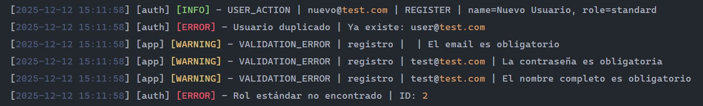

**log Error**
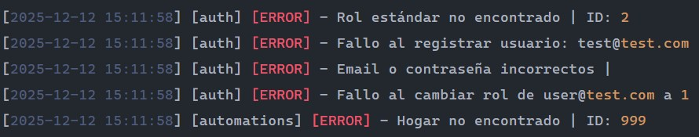

---

[Tabla de contenidos](#tabla-de-contenidos)

# Validaciones y Seguridad

Validaciones robustas en todas las entradas:

- ✅ Email con formato correcto
- ✅ Contraseñas seguras
- ✅ Nombres sin caracteres especiales
- ✅ IDs positivos
- ✅ Descripciones con longitud mínima

---

[Tabla de contenidos](#tabla-de-contenidos)

# Manejo de Excepciones

Excepciones personalizadas por tipo de error:

- `ValidationException` - Errores de validación
- `DatabaseException` - Errores de BD
- `EntityNotFoundException` - Entidad no encontrada
- `DuplicateEntityException` - Duplicados
- `AuthenticationException` - Errores de autenticación

---

[Tabla de contenidos](#tabla-de-contenidos)

# Autores

**Fernando Agustín Moyano**

---

**Última actualización:** Diciembre 2025  
**Versión:** 1.0.0
